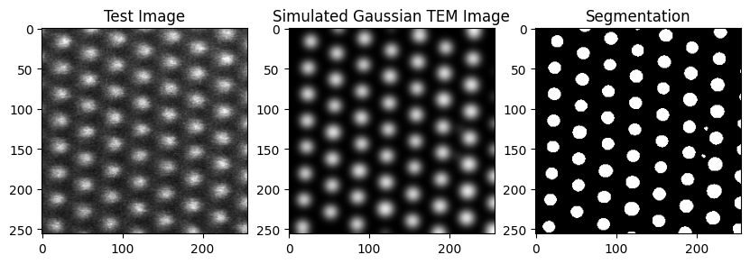
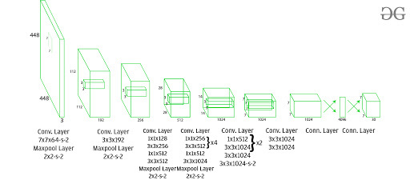

# De-noising-segmentation-and-localization-of-TEM-images-using-deep-learning-models

This project combines the U-Net architecture and a Gaussian de-noising filter for performing segmentation and denoising of Transmission Electron Microscopy (TEM) images simultaneously. The YOLO (You Only Look Once) algorithm will be used for further localization.

## Table of Contents

- [Introduction](#introduction)
- [Usage](#usage)
  - [Requirements](#requirements)
- [Results](#results)
- [Approach](#approach)
  - [U-Net Architecture](#u-net-architecture)
  - [Gaussian Filter](#gaussian-filter)
  - [YOLO Algorithm for Localization](#yolo-algorithm-for-localization)

- [Contributing](#contributing)
- [License](#license)

## Introduction

Transmission Electron Microscopy (TEM) is a crucial imaging technique in various scientific and medical fields. However, TEM images often suffer from noise, making accurate segmentation and analysis challenging. This project addresses these challenges by leveraging the U-Net architecture for segmentation, a Gaussian de-noising filter for noise reduction, and the YOLO algorithm for localization.

## Usage

### Requirements

Before using this project, ensure you have the following dependencies installed:

- Python (>=3.6)
- TensorFlow (>=2.0)
- Keras (>=2.0)
- OpenCV (>=4.0)

## Results

## Approach

### U-Net Architecture

The U-Net architecture is a convolutional neural network (CNN) commonly used for image segmentation tasks. It consists of an encoder-decoder structure with skip connections, enabling the model to capture both global context and local details.

### Gaussian Filter

The Gaussian de-noising filter is a classical image processing technique used to reduce noise in images. It applies a Gaussian kernel to smooth out pixel values, resulting in cleaner and more visually appealing images.

### YOLO Algorithm for Localization
The YOLO (You Only Look Once) algorithm is a real-time object detection system that divides an image into a grid and predicts bounding boxes and class probabilities for objects within each grid cell. It is efficient and accurate, making it suitable for localization tasks.

## Contributing
Contributions to this project are welcome! If you have any suggestions, bug fixes, or improvements, feel free to open an issue or create a pull request.
